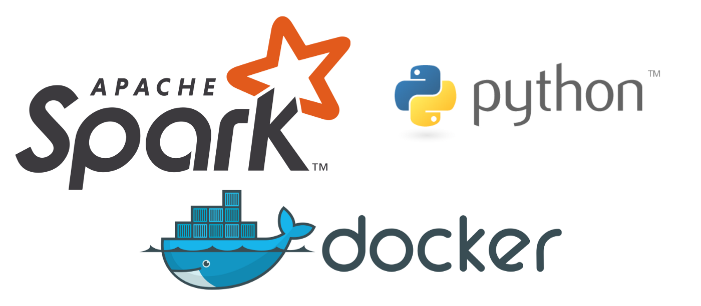

```python
from IPython.core.display import Image
Image('headerimage.png')
#

```


In this blog I going to show you how you could easily use the Pyspark to run sql codes on the gigabyte scale dataset. 

Now, here the docker will be used to make usage of the pyspark very easy. Since there is a Docker image of pyspark in Jupyter, we will use that docker to use the Pyspark. So, the first thing you must know is your OS has a Docker engine.

The Linux user will not have big problem with this one they can simply follow the instruction to set-up the docker in their OS from the link:

[I'm an inline-style link](https://docs.docker.com/engine/install/ubuntu/)

For Windows user you can follow the official link to set-up your docker engine:

[Docker Manual Windows:](https://docs.docker.com/docker-for-windows/install/)

## Create or upload a Jupyter notebook

Run the following commands in your Terminal, substituting `<MY-WEBSITE-FOLDER>` and `<SHORT-POST-TITLE>` with the file path to your Academic website folder and a short title for your blog post (use hyphens instead of spaces), respectively:

```bash
mkdir -p <MY-WEBSITE-FOLDER>/content/post/<SHORT-POST-TITLE>/
cd <MY-WEBSITE-FOLDER>/content/post/<SHORT-POST-TITLE>/
jupyter lab index.ipynb
```

The `jupyter` command above will launch the JupyterLab editor, allowing us to add Academic metadata and write the content.

## Edit your post metadata

The first cell of your Jupter notebook will contain your post metadata ([front matter](https://sourcethemes.com/academic/docs/front-matter/)).

In Jupter, choose _Markdown_ as the type of the first cell and wrap your Academic metadata in three dashes, indicating that it is YAML front matter: 

```
---
title: My post's title
date: 2019-09-01

# Put any other Academic metadata here...
---
```

Edit the metadata of your post, using the [documentation](https://sourcethemes.com/academic/docs/managing-content) as a guide to the available options.

To set a [featured image](https://sourcethemes.com/academic/docs/managing-content/#featured-image), place an image named `featured` into your post's folder.

For other tips, such as using math, see the guide on [writing content with Academic](https://sourcethemes.com/academic/docs/writing-markdown-latex/). 

## Convert notebook to Markdown

```bash
jupyter nbconvert index.ipynb --to markdown --NbConvertApp.output_files_dir=.
```

## Example

This post was created with Jupyter. The orginal files can be found at https://github.com/gcushen/hugo-academic/tree/master/exampleSite/content/post/jupyter
